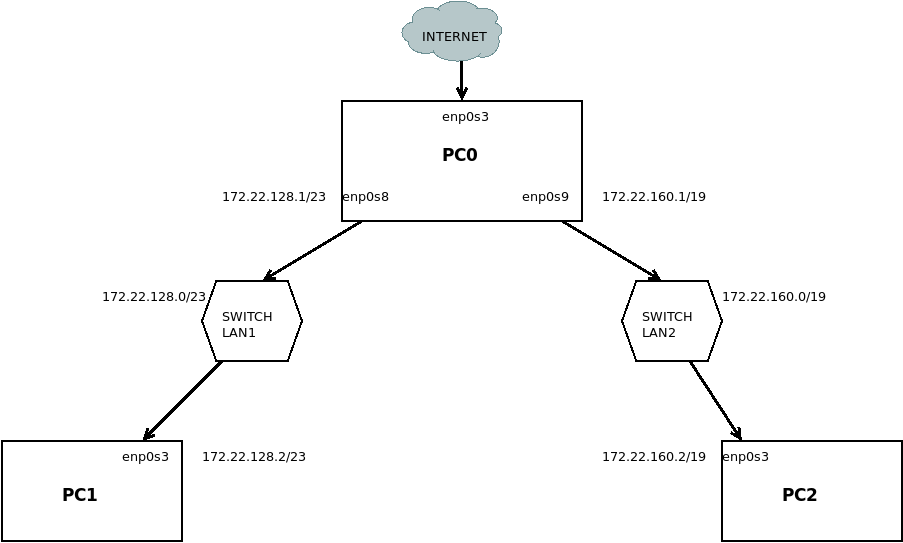

```
1. Ustalenie netmaski
  - dla 500 urządzeń 255.255.254.0 czyli /23
  - dla 5000 urządzeń 255.255.224.0 czyli /19
  
2. Ustalenie adresów sieci
  Tu można ustalać jak sie chce. IP bazowy to 172.22.128.0 więc ja sobie podzieliłem to tak:
  - lan1 172.22.128.0/23
  - lan2 172.22.160.0/19
 
  Chodzi o to że netmaska określa ile następnych adresów IP jest zarezerwowane dla danej sieci i od jakiego adresu sie może 
  zaczynać. Tzn przy /23 jest to 510 więc pierwsza sieć będzie sobie od 172.22.128.0 i kolejne 510 adresów do 172.22.129.254 
  (+ 1 specjalny na broadcast). 
  
  Przy tej samej netmasce można by było teraz brać od 172.22.130.0 ALE jest inna maska - /19 która daje 8190 adresów i inaczej 
  sie dzieli. Od 172.22.128.0 idzie do 172.22.159.254. Niestety nie można sobie ustalić lan1 i 2 z tym samym adresem sieci i 
  tylko innymi maskami bo jest konflikt przy wysyłaniu pakietów więc trzeba brać następne dostępne. Lan1 musi mieć /23 a lan2 
  /19. Trzeba ogarnąć jakie są dostępne podziały przy /19. Od bazowego kończy sie na 159 potem od 160 do 191 i potem od 192 do 
  223 i na koniec od 224 do 255.
  
  Pewnie troche poplątałem ale jak wpiszecie ip bazowe i maske wybierzecie tu: 
  https://www.calculator.net/ip-subnet-calculator.html i na range zobaczycie to myśle że połapiecie o co chodzi.

3. Dodanie adresów ip (najlepiej w /etc/network/interfaces)
  Tutaj wybieracie sobie jakie chcecie IP z zakresu ogarniętego w poprzednim punkcie
  - PC0
  enp0s8
    address 172.22.128.1
    netmask 255.255.254.0
  enp0s9
    address 172.22.160.1
    netmask 255.255.224.0
  - PC1
    address 172.22.128.2
    netmask 255.255.254.0
  - PC2
    address 172.22.160.2
    netmask 255.255.224.0

4. Ustalenie routingu (też interfaces)
  - PC1
    up ip route add default via 172.22.128.1
  - PC2
    up ip route add default via 172.22.160.1
    
5. Włączenie forwardowania pakietów na PC0
  echo 1 > /proc/sys/net/ipv4/ip_forward
  lub na stałe
  odkomentować net.ipv4.ip_forward=1 w /etc/sysctl.d/99-sysctl.conf
  
6. Dodanie reguły masquerade na PC0
  iptables -t nat -A POSTROUTING -s 172.22.128.0/23 -o enp0s3 -j MASQUERADE
  to samo dla -s 172.22.160.0/19
  
7. Dodanie adresów dns do PC1 i PC2 (opcjonalne)
  /etc/resolv.conf
  nameserver 1.1.1.1
```
